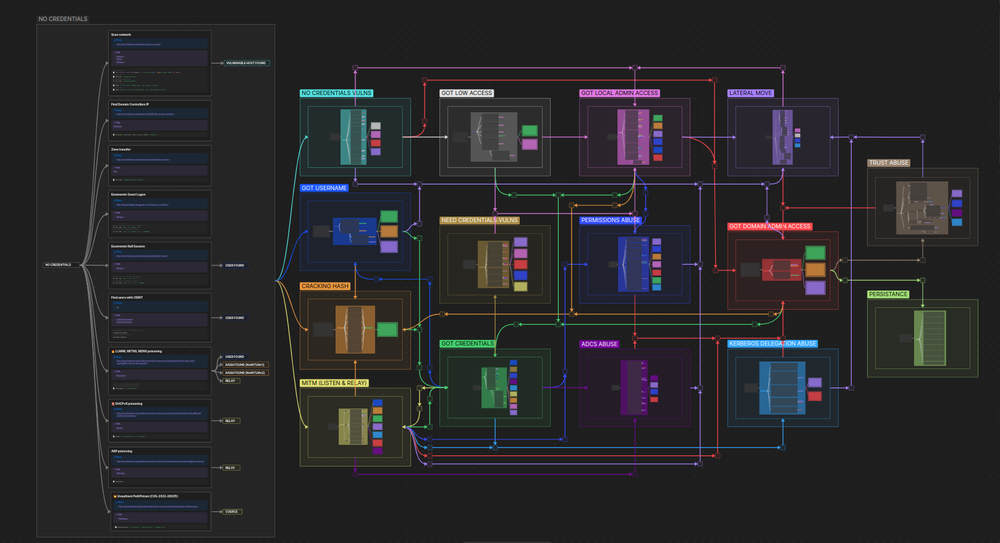

# ADMR – Active Directory Mindmap Recipes  
> *Compromise, à la carte.*

---

## 📌 Table of Contents  
1. [Overview](#overview)  
2. [Project Goals](#project-goals)  
3. [Mindmap Preview](#mindmap-preview)  
4. [Structure & Logic](#structure--logic)  
5. [How to Use](#how-to-use)  
6. [Emoji Code System](#emoji-code-system)  
7. [Contributing](#contributing)  
8. [Authors](#authors)  
9. [License](#license)  
10. [Acknowledgments](#acknowledgments)

---

## 🧾 Overview  
**ADMR** is an **interactive mindmap** base on obsidian designed to support **Active Directory pentesting**.  
It organizes attacks based on context and follows a clear logic: **input → action → output**.

Inspired by existing projects like the **OCD mindmap** and **Hacker Recipes**, ADMR is built to be more **readable**, **clickable**, and **practical** for real-world use in everyday pentest assessments.

---

## 🎯 Project Goals  
- Structure AD attack paths in a logical and contextualized way  
- Provide a fast, visual, and interactive reference  
- Enable easy access to theory, tools, and tested commands  
- Be offline-ready, customizable, and open-source  
- Save time during engagements with less searching and more acting

---

## 🧩 Mindmap Preview  
  

---

## 🧱 Structure & Logic  

### 🔹 Organized by context:  
Each main node represents a **specific situation** during an engagement. For example:  
- 🔒 **NO CREDENTIALS VULNS**  
- 👤 **GOT USERNAME**  
- 🔑 **GOT CREDENTIALS**  
- 🌀 **GOT LOW ACCESS**  
- 🖥️ **GOT LOCAL ADMIN**  
- 🏰 **GOT DOMAIN ADMIN**  
- 📜 **ADCS ABUSE**  
- 🔓 **CRACKING HASH**  
- 🎫 **KERBEROS DELEGATION ABUSE**  
- ↔️ **LATERAL MOVE**  
- 📡 **MITM (LISTEN & RELAY)**  
- ❓ **NEED CREDENTIALS VULNS**  
- 🛡️ **PERMISSIONS ABUSE**  
- 📌 **PERSISTENCE**  
- 🤝 **TRUST ABUSE**

### 🔹 Each attack includes:  
- 📚 **Theory** → Useful links to quality resources  
- 🛠 **Tools** → Tools used for exploitation  
- 💻 **Command list** → Tested commands ready for use  
- 🔖 **Emoji tags** to assess priority and risk

---

## 💻 How to Use  
- git clone the repo
- Open the folder as Obsidian vault
- Explore by context depending on your engagement progress
- Review theory, commands, and tools
- Modify or extend with your own findings

## 🔖 Emoji Code System
### Attack Types
- 🔥 Quick wins – Easy, fast, low-noise attacks
- 💥 CVE – Public vulnerabilities
- 🚨 Can break things – Risky or noisy techniques
- 🛠️ Work in progress – Still being tested or improved

### Tool Tags
- ⚪ Linux commands
- ⚫ CMD (Windows)
- 🔵 PowerShell
- 🟣 Impacket
- 🔴 BloodHound
- 🕷️ NetExec
- Ⓜ️ Metasploit

---

## 🤝 Contributing

We welcome contributions! You can:

- Add new attack techniques  
- Improve existing sections  
- Suggest changes or refactors  
- Fix typos or dead links  
- Enhance structure or styling  

> 📬 Open a pull request or create an issue 💬

---

## 👥 Authors

- **Amine B.** ([@gr0bot](https://github.com/gr0bot))  
- **Evariste Gwanulaga** ([@bl4ckarch](https://github.com/bl4ckarch))

---

## 📄 License

This project is licensed under the **GNU GENERAL PUBLIC LICENSE Version 3**.  
Feel free to use, modify, and share — just give credit when you do.

---

## 🙏 Acknowledgments

Big thanks to the following for their inspiration and contributions to the field:

- **[Orange Cyberdefense](https://github.com/Orange-Cyberdefense/ocd-mindmaps)** – for the original AD mindmap  
- **[Hacker Recipes](https://www.thehacker.recipes/)** – for structuring practical attack workflows
- **[Ecole 2600](https://www.2600.eu/)**